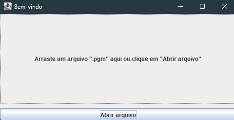
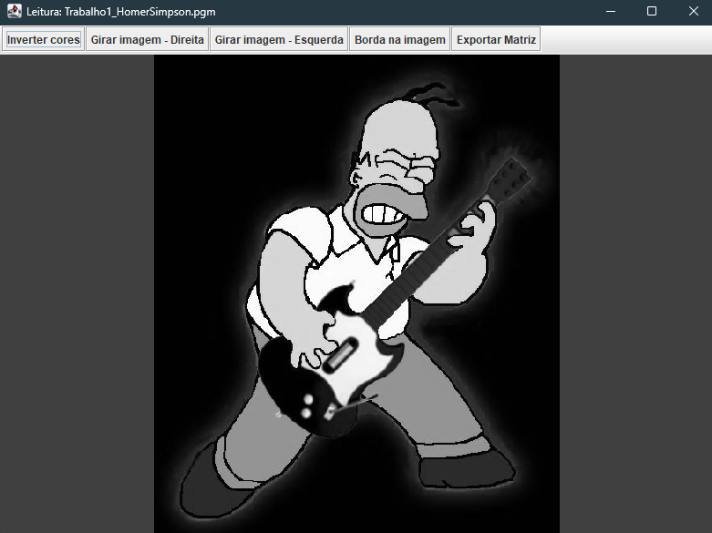
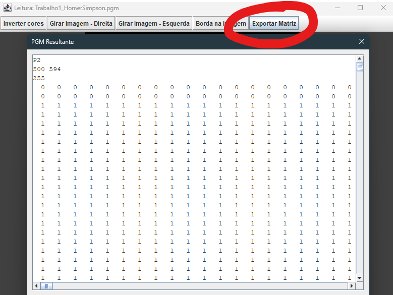
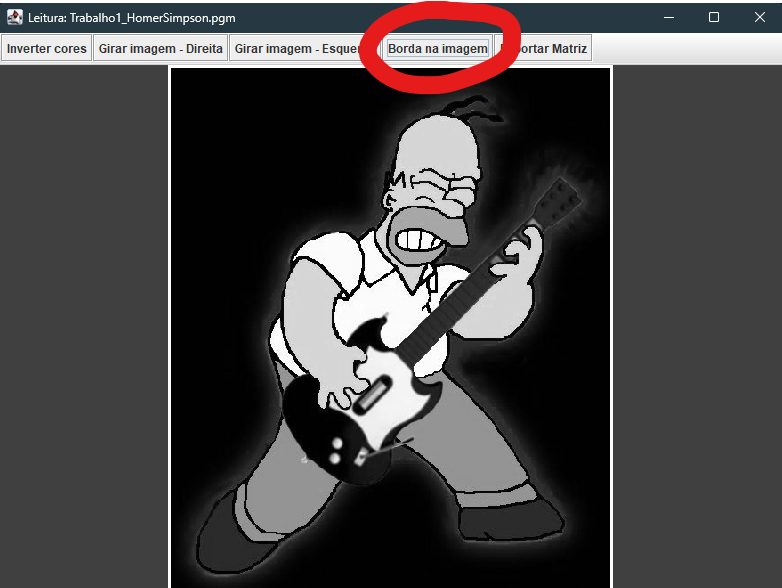
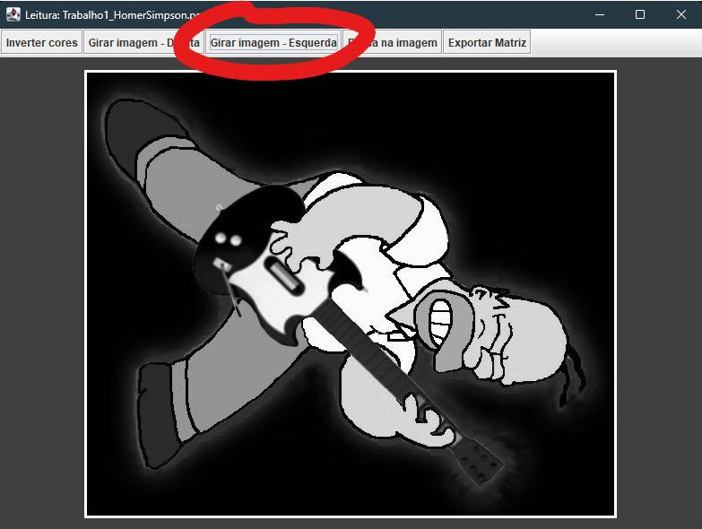
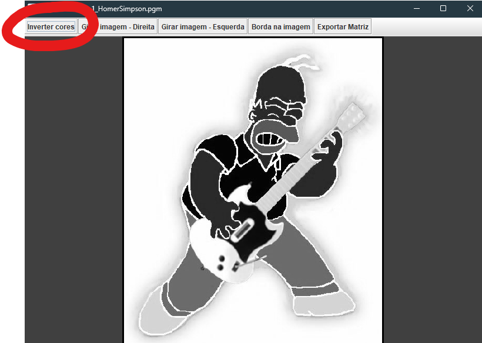

# Leitor e Processador de PGM (P2) com Matriz Esparsa

Aplicação Java Swing para leitura de imagens PGM no formato P2 (texto), armazenando os pixels em uma matriz esparsa e oferecendo operações de processamento como inverter cores, girar 90° (direita e esquerda) e inserir uma borda branca de 3 pixels, com visualização imediata no painel de imagem.

A interface inicial permite abrir o arquivo via botão ou por arrastar-e-soltar arquivos “.pgm”. Após a seleção, a tela de leitura exibe uma barra de ferramentas com os comandos de processamento e a opção de exportar a matriz PGM resultante em texto monoespaçado.

## Como executar

- Execute a classe `main` que inicializa a interface gráfica, criando a `TelaEntrada` via `SwingUtilities`.
- Ao abrir um arquivo PGM válido (P2), a aplicação carrega a imagem, cria a tela de leitura e exibe a visualização gerada a partir da matriz esparsa, permitindo aplicar as operações disponíveis.

## Apresentação do sistema

A aplicação é composta por duas etapas principais: a Tela inicial/Entrada, onde o usuário seleciona ou arrasta o arquivo PGM (P2), e a Tela Leitura/Imagem, onde são exibidas as transformações e a exportação do resultado. Abaixo, uma visão visual e descritiva de cada etapa.

### Tela inicial/Entrada

Nesta tela é possível:
- Abrir um arquivo “.pgm” (P2) pelo botão “Abrir arquivo”.
- Arrastar e soltar o arquivo diretamente no painel central.
- Em caso de arquivo inválido ou fora do padrão P2, é exibida uma mensagem de erro descritiva.
- Ao carregar com sucesso, a imagem segue para a Tela Leitura/Imagem.

  <figure style="margin:0; text-align:center; width:350px;">
    
    <figcaption style="margin-top:8px; color:#666;"><em>Tela inicial</em></figcaption>
  </figure>

### Tela Leitura/Imagem

Nesta tela o usuário:
- Visualiza a imagem em escala de cinza gerada a partir da matriz esparsa.
- Executa operações: inverter cores, girar 90° (direita e esquerda) e inserir borda branca de 3 px.
- Exporta a matriz resultante no formato P2 (texto) em fonte monoespaçada para fácil cópia.

  <figure style="margin:0; text-align:center; width:350px;">
    
    <figcaption style="margin-top:8px; color:#666;"><em>Imagem cinza</em></figcaption>
  </figure>

  <figure style="margin:0; text-align:center; width:350px;">
    
    <figcaption style="margin-top:8px; color:#666;"><em>Exportacao da matriz</em></figcaption>
  </figure>

 

  <figure style="margin:0; text-align:center; width:350px;">
    
    <figcaption style="margin-top:8px; color:#666;"><em>Borda branca (3 px)</em></figcaption>
  </figure>

  <figure style="margin:0; text-align:center; width:350px;">
    
    <figcaption style="margin-top:8px; color:#666;"><em>Giro 90° (direita)</em></figcaption>
  </figure>

  <figure style="margin:0; text-align:center; width:350px;">
    
    <figcaption style="margin-top:8px; color:#666;"><em>Inverter cores (v → 255 − v)</em></figcaption>
  </figure>

## Fluxo da aplicação

- A `TelaEntrada` exibe um botão “Abrir arquivo” e aceita drag-and-drop de arquivos; ao selecionar/soltar um `.pgm`, o arquivo é processado e um objeto `PGM` é criado.  
- A classe `PGM` verifica o P2, ignora comentários “#”, lê largura, altura e `maxVal`, normaliza para 0–255 se necessário, e preenche apenas valores não zero na `MatrizEsparsa`.  
- A `TelaLeitura` constrói um `BufferedImage` em escala de cinza a partir de um `int[][]` materializado da `MatrizEsparsa` e exibe em um `ImagePanel` ajustado ao painel.  
- Os botões da barra de ferramentas chamam métodos em `PGM`/`MatrizEsparsa` para inverter cores, girar à direita/esquerda e inserir uma borda branca de 3 px, atualizando a imagem renderizada.  

## Funcionalidades principais

- Inverter cores: aplica \(v \mapsto 255 - v\) em todos os pixels; quando o resultado é 0, o nó é removido para manter a esparsidade.  
- Girar 90° à direita: mapeia \((r, c) \rightarrow (c, \text{rows} - 1 - r)\) e retorna nova `MatrizEsparsa` aplicada ao estado do `PGM`.  
- Girar 90° à esquerda: mapeia \((r, c) \rightarrow (\text{cols} - 1 - c, r)\) e atualiza a matriz do `PGM` com o resultado.  
- Inserir borda branca (3 px): sobrescreve topo, base, esquerda e direita com valor 255, respeitando dimensões mínimas.  
- Exportar PGM: gera texto P2 com largura, altura e `maxVal = 255`, usando largura fixa de 3 caracteres por pixel, e exibe em um `JTextArea` monoespaçado em um `JOptionPane`.  

## Arquitetura e arquivos

- `main.java`: ponto de entrada, executa a GUI com `SwingUtilities`, abrindo a `TelaEntrada`.  
- `TelaEntrada.java`: `JFrame` inicial com botão “Abrir arquivo” e suporte a drag-and-drop de lista de arquivos; cria `PGM` a partir do caminho e abre `TelaLeitura` com a matriz comum.  
- `TelaLeitura.java`: `JFrame` principal de visualização com `JToolBar` e botões para inverter, girar direita/esquerda, borda e exportar; converte `int[][]` para `BufferedImage` em tons de cinza via `WritableRaster`.  
- `ImagePanel.java`: `JPanel` customizado que desenha `BufferedImage` centralizado.
- `PGM.java`: serializador P2, normaliza `maxVal` para 255 quando preciso, mantém uma `MatrizEsparsa` interna e expõe operações de inversão, borda e rotações.  
- `MatrizEsparsa.java`: implementação encadeada por linhas e colunas, armazenando apenas nós não nulos e oferecendo `get/set/remove`, materialização densa, inversão de cores, rotações e borda.  
- `InterfaceMatrizEsparsa.java`: contrato com operações essenciais de consulta, modificação e transformações (inverter, borda, girar).  

## Formato PGM suportado

- O leitor aceita exclusivamente P2, valida dimensões e `maxVal`, ignora comentários iniciados por “#” e converte os valores lidos para a faixa 0–255 caso `maxVal` seja diferente de 255.  
- Durante a carga, apenas pixels não zero são inseridos na estrutura esparsa, e zeros permanecem implícitos como ausência de nó.  

## Limitações e melhorias

- Atualmente, so é aceito o formato P2 e não faz leitura de P5, o que pode ser uma melhoria futura.  
- A exportação exibe o texto em um diálogo para cópia, mas não salva automaticamente em arquivo, com isso e viavel a criacao do “Salvar como”.  

## Espaço para imagens

- Tela de entrada (arrastar/soltar + botão Abrir arquivo): insira aqui a captura da `TelaEntrada`.  
- Exemplo 1 — Borda 3 px: insira aqui a imagem resultante após “Borda na imagem”.  
- Exemplo 2 — Giro 90° direita: insira aqui a imagem após “Girar imagem - Direita”.  
- Exemplo 3 — Inverter cores: insira aqui a imagem após “Inverter cores”.  

## Referência rápida de APIs principais

- `PGM.gerarPGM()`: gera string P2 com cabeçalho “P2”, dimensões (colunas linhas) e `maxVal = 255`, com pixels alinhados em largura 3.  
- `PGM.matrizComum()`: materializa a matriz esparsa para `int[][]` para renderização.  
- `MatrizEsparsa.inverterCores()`: aplica \(255 - v\) a cada posição, removendo nós que se tornam zero.  
- `MatrizEsparsa.girar90Horario()`/`girar90AntiHorario()`: recalcula índices e devolve nova matriz rotacionada.  
- `MatrizEsparsa.inserirBordaBranca3px()`: escreve 255 no contorno superior, inferior, esquerdo e direito com espessura fixa \(B = 3\).  
